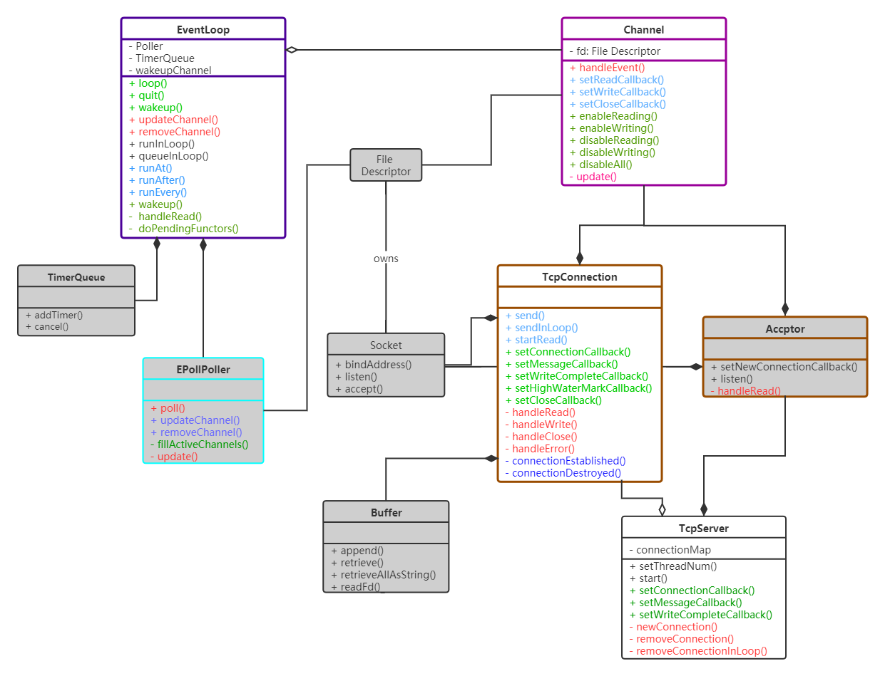

# Libfm: A fake muduo network library

## 一. 简介

顾名思义，libfm是一个仿照muduo实现的基于Reactor事件驱动模式的C++多线程网络库，相比于原来的代码本项目有着如下的特点：

- 更简洁的线程模型，基于C++11提供的线程库，而不再像muduo一样重复造轮子；
- 更易用的时间库，类似于`std::chrono`时间库，且复用`std::chrono::duration`，并与`fm::time::Timetamp`、`fm::time::SystemClock`一起组成时长、时间戳、时钟三个概念；
- 更简单的时间轮询器，只基于`epoll`而不再支持`poll`，减少了虚调用的性能开销；
- 其他，一些小的代码优化，包括优化类结构、增加移动语义等。

至于该网络库的实现原理推荐看看我自己写的[项目解读](docs/项目解读.md)，更新后的网络库结构如下：




## 二. 使用

在libfm中，所有的功能都是基于函数回调实现的。因此为了使用libfm，必须在自定义的服务器类中设置Tcp服务器TcpServer类对象的回调函数，这样当客户请求消息到来的时候libfm就会自动的调用你注册的回调函数。这些回调函数包括：

- 定时器过期时的回调函数TimerCallback
- 客户连接建立/断开的回调函数ConnectionCallback 
- 客户数据到来的回调函数MessageCallback 
- 完成向客户写数据的回调函数WriteCompleteCallback 
- 接收数据超过高水位线的回调函数HighWaterMarkCallback 

至于上述回调函数的调用形式怎样，可以查看头文件`libfm/net/Callback.h`中的定义。如果上述的回调函数不定义，那么网络库就会对相应的事件做出默认的处理，一般就是忽略。

例如我们需要构建一个日期时间服务器（客户建立到服务器的Tcp连接之后服务器就发送日期时间字符串，为了不将TIME_WAIT这个状态留在服务器我选择让客户端来主动关闭连接。如果客户端继续发送过来数据，服务器只需要忽略就可以了），那么我们至少需要向TcpServer类注册一个ConnectionCallback（不过为了保证客户后续客户仍然发送过来数据，我们还是多注册了一个MessageCallback），如下所示：

```cpp
class DatetimeServer {
 public:
  DatetimeServer(EventLoop *loop,
                 const InetAddress &address,
                 const std::string &str)
      : server_(loop, address, str) {
    // 在DatetimeServer启动之初注册回调函数
    server_.setConnectionCallback([this](const TcpConnectionPtr &conn) {
      this->onConnection(conn);
    });
    server_.setMessageCallback(std::bind(&DatetimeServer::onMessage,
                                         this, _1, _2, _3));
  }

  void setThreadsNum(int threads) { server_.setThreadNum(threads); }
  void start() { server_.start(); }

 private:
  // 客户数据到来时的回调函数
  void onMessage(const TcpConnectionPtr &conn, Buffer *buffer, time::Timestamp now) {
    // unlikely!
    buffer->retrieveAll();
  }

  // 客户连接到来时的回调函数
  void onConnection(const TcpConnectionPtr &conn) {
    if (conn->isConnected())
      conn->send(time::SystemClock::now().toString());
  }

 private:
  TcpServer server_;
};
```

当这个日期时间服务器构建成功后，剩下的就是最简单的`main()`函数部分：

```cpp
int main() {
  EventLoop loop;
  InetAddress address(12000);
  DatetimeServer server(&loop, address, "DatetimeServer");
  server.start();
  loop.loop();
}
```

最后编译链接的时候链接上fmbase和fmnet两个库文件即可。


## 三. 编译安装

```bash
$> git clone https://github.com/Ye-zixiao/Libfm.git
$> sh ./build.sh
```


## 四. 参考资料

1. [Linux多线程服务端编程](https://detail.tmall.com/item.htm?spm=a230r.1.14.14.6fa3597eib5rju&id=643242317479&ns=1&abbucket=6)
2. [CMake Cookbook](https://github.com/xiaoweiChen/CMake-Cookbook)
3. [CMake 入门实战 | HaHack](https://www.hahack.com/codes/cmake/)

