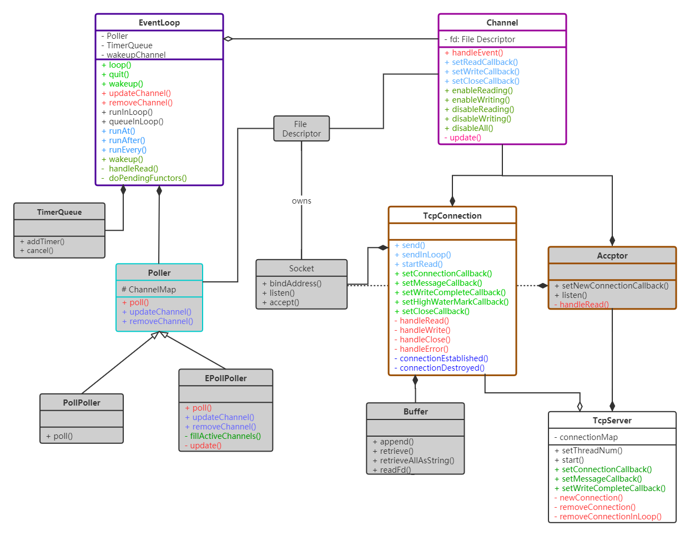

# FakeMuduo

## 一. 基础库base

muduo基础库base中的组件都是一些网络服务器编程中经常使用的组件，包括线程池、有界阻塞队列、日志记录基础设施等。其中如下几个组件是我们了解muduo项目时非常必要的：

- 时间戳类`TimeStamp`
- 线程池类`ThreadPool`
- 日志基础设施类`Logging`、`LogStream`，以及涉及到日志文件滚动输出的类`LogFile`、`FileUtil`

> 需要注意的是还有一些基础设施类虽然在muduo库中比较重要，但是在我自己的FakeMuduo中并没有继续采用，例如线程类Thread、条件变量类Condition的实现等。它们完全可以使用C++11标准库中的东西进行替代。


### 1. 时间戳TimeStamp

<center>
    
</center>


时间戳的实现比较简单，最大的功能就是能够提供记录当前时刻的功能。


### 2. 线程池ThreadPool

<center>
    
</center>


线程池的实现也非常简单，最主要的成员函数就是如下几个：

|     成员函数名      |                             功能                             |
| :-----------------: | :----------------------------------------------------------: |
|    **`start()`**    |        创建、启动线程池中的工作线程，并加入到容器之中        |
|    **`stop()`**     | 停止线程池中工作线程的继续运行，但会让工作线程先把<br />手头上的工作执行完毕后再退出 |
|   **`run(Task)`**   | I/O线程将需要回调的可调用对象通过任务队列发送给工作线程处理  |
| **`runInThread()`** | 工作线程所执行的线程函数，它会要求工作线程不断地从<br />任务队列中取出任务进行执行，如果没有就阻塞在条件变量的等待<br />队列之中。或许叫它为工作线程函数workerThreadFunc也挺合适 |
|    **`take()`**     |           从任务队列中取出一个用以回调的可调用对象           |


### 3. 日志基础设施Logger

#### 3.1 日志流LogStream

<center>
    
</center>


日志流的功能很简单，但在日志基础设施的实现中也非常重要。它的主要功能就是维护一个固定足量大小的缓冲区，后续的日志类通过它的`operator<<()`输出运算符向其添加数据（并自动转换成字符串的形式）到日志流类对象中维护的缓冲区中。然后最后由后续的Logger类在它需要析构的时候自动将这些格式化的字符串输出到标准输出或者文件之中。

下面是FixedBuffer的缓冲区示意图：

<center>
    
</center>


#### 3.2 日志器Logger

<center>
    
</center>


在日志基础设施中最为重要的就是日志器Logger，它负责单次日志信息的收集，并在其析构的时候格式化的日志字符串输出到标准输出或者日志文件（需要FileUtil类和LogFile两个类的支持）之中。

其中Logger主要用到了两个内部类：

1. `SourceFile`，它的作用就是用来在给定`__FILE__`字符串宏（当前源文件名）中提取出它的basename，并将其字符串指针保存在SourceFile之中；
2. `Impl`，它可以认为是整个日志器Logger的核心。它主要负责将SourceFile中的basename、当前线程ID、当前时间、日志级别、用户给定字符串、errno返回出的错误字符串等格式化到LogStream日志流对象之中，具体添加的这些信息的手段，很大程度都是依靠LogStream的`operator<<`完成的。

除此之外，在日志器类Logger中，还有一些成员也非常重要，例如用来设置当前日志设施的日志级别`setLogLevel()`、设置当前日志基础设施的日志刷新函数`setFlush()`和设置当前日志基础设施的输出函数`setOutput()`等。

剩下的我们在Logger实现文件的最后定义了一些宏，方便不同级别的日志输出，例如常用的`LOG_TRACE`就是用来最终函数的执行过程，`LOG_INFO`用来进行信息通告等等。


##### 3.2.1 日志输出的执行链

```c++
#define LOG_TRACE if(Logger::logLevel() <= Logger::TRACE) \
    Logger(__FILE__, __LINE__, Logger::TRACE, __func__).stream()
```

最后我们来描述下的一次日志消息（以上面的`LOG_TRACE`为例）的调用链：

1. 首先为了输出一次日志消息，我们会通过上面的宏创建并初始化一个日志器对象Logger；

2. 日志器Logger在创建的过程中会先初始化SourceFile，获取当前的源文件basename：

   ```c++
   Logger(SourceFile file, int line, LogLevel level, const char *func);
             |
             v
   explicit SourceFile(const char *filename);
   ```

3. 接着Logger的构造函数会在开始初始化内部实现类Impl的数据成员，在它的构造之初，会将当前时间的格式化字符串、线程ID、errno错误消息以及当前函数源文件的basename（即上面SourceFile提取出的信息）添加到impl内部的LogStream类对象的FixedBuffer中：

   ```c++
   Logger::Logger(SourceFile file, int line, LogLevel level, const char *func)
   	: impl_(level, 0, file, line) {
     impl_.stream_ << func << ' ';
   }
               |
               v
   Logger::Impl::Impl(LogLevel level, int old_errno, const SourceFile &file, int line)
   	... {
     formatTime();
     stream_ << ' ' << gettid() << ' '; // 不使用pthread_self()
     stream_ << LogLevelName[level];
     if (old_errno != 0)
   	stream_ << strerror_ts(old_errno) << " (errno=" << old_errno << ") ";
   }
   ```
   
4. 然后用户通过`LOG_TRACE`宏创建的Logger对象的`.stream()`成员函数返回内部LogStream类对象的引用，通过`operator<<`运算符向其继续添加自定义的日志消息；

5. 最后输出完毕之后，离开这条语句，这个日志器对象就会自动析构。而析构的时候会自动将内部的日志消息自动输出到标准输出stdout中。

   ```c++
   Logger::~Logger() {
     impl_.finish();
     const LogStream::Buffer &buf(stream().buffer());
     g_output(buf.data(), buf.length());
     if (impl_.level_ == FATAL) {
   	g_flush();
   	abort();
     }
   }
   ```

这样我们基本上就理清了一次日志输出的大致过程，简要一点就是如下的使用过程：

<center>
    
</center>


#### 3.3 日志文件LogFile

如果我们上面输出的日志仅仅需要输出到stdout标准输出中，那么上面的几个类其实完全够用。但是如果需要将这些日志消息输出到滚动更新的日志文件中，那么就需要LogFile和FileUtil这两个类的支持。


## 二. 网络库net

<center>
    
</center>


上面是我为muduo网络库绘制的UML类图，大体的展示了muduo网络库net部分的实现关系。由于muduo网络库的设计采用的是Reactor模式，但在实现上又不完全如Reactor模式论文提出者那样的方式来进行实现。其中论文提出者提出的Reactor模式的类架构体系类似于观察者模式，更多的是采用多态/虚调用的方式来实现事件处理器注册函数的回调；但对于muduo而言，由于它采用的是基于对象的编程方式，所以没有采用上述的方式，在绝大多数的情况，都是通过组合的方式来替代继承。这一点可能参照了“合成复用原则”——多用组合/聚合少用继承。

为了能够实现与论文提出者相同的功能，muduo引入了频道类Channel，用来替代典型Reactor模式中描述的EventHandler。在Reactor论文中指出：每一个具体的事件处理器都需要继承EventHandler，然后通过多态的方式以基类指针注册到事件分发器Dispatcher的事件循环中。而在muduo中，换了种方式，是：每一个事件处理器（包括TcpConnection、Acceptor、TimerQueue等）都需要组合一个Channel，使用时将Channel注册到事件循环EventLoop中。因此，我们可以知道频道类Channel描述了所有事件处理器中事件处理可回调的共性！

<center>
    
</center>


通过上面Reactor原论文中的类图，可以发现，两者有差别，但它们所描述的逻辑原理都是相同的。我们可以以表格形式来对比：

|                 模块                 |                     Reacotr原论文的设计                      |                         muduo的设计                          |
| :----------------------------------: | :----------------------------------------------------------: | :----------------------------------------------------------: |
|            **事件的轮询**            | 通过同步事件多路解复用器Synchronous<br />Event Demultiplexer来完成 |                    通过轮询器Poller来完成                    |
|          **事件循环/分发**           |          通过分派器Initiation Dispatcher来回调分发           |                通过事件循环类EventLoop来完成                 |
| **事件处理器可回调<br />处理的抽象** | 通过事件处理器Event Handler这个接口<br />来提供，每个具体事件处理器都要继承它 | 通过频道Channel类以组合进具体<br />事件处理器的方式来提供共同属性 |
|          **具体事件处理器**          |                    需要继承Event Handler                     |                       需要组合Channel                        |

由上表可知，其实两者大体上差别不大，最主要的差别就两者在“事件处理器可回调处理”这一抽象的表达上的不同，单元里都是相同的。其他都只是换了个名字，理解起来问题不大。


> 经过上面的分析，其实我们也可以了解到对于muduo而言，其网络库中最主要的还是如下几个类：
>
> 1. 事件循环类**EventLoop**
> 2. 事件轮询类**Poller**
> 3. 频道类**Channel**（事件处理器可回调处理的抽象）
> 4. 具体事件处理器，包括：
>    - 网络I/O或连接事件处理器**TcpConnection**
>    - 网络连接请求事件处理器**Accptor**
>    - 系统定时器队列TimeQueue
> 5. TCP服务器类**TcpServer**，它是TcpConnection、Accptor的综合封装
>
> 至少大致了解了这几个类的工作原理，muduo也就基本上没问题了。


### 1. 网络库基础类

在muduo中如下几个类或者文件提供了最基本的网络服务器基本基础设施的功能，包括：

1. SocketetsOps.h/cpp这两个文件封装了大多数我们常用的套接字相关函数
2. Endian.h这个头文件中的内容提供给我们主机字节序与网络字节序之间相互转换的函数，当然也是封装了Linux中比较原始的文件而成的
3. InetAddress类封装了套接字协议地址，方便我们提供给下面的套接字类Socket我们想要的IP+端口号的信息
4. Socket类封装了套接字以及套接字连接、地址绑定、监听、接收等一系列的操作
5. Callback头文件中的声明指出了一个事件处理器应该提供怎样的回调接口。包括：可读事件回调接口、可写事件回调接口、读完成事件回调接口、高水位线回调接口、消息接收回调接口（可读事件触发，有时如果中间加入了一个编解码器，那么只有可能在读取完一个消息之后才会触发）
6. Buffer应用层缓冲区类向TcpConnection提供了数据读缓存和写缓存的能力，这是使用非阻塞I/O时必备的基础设施。实际上它在muduo网络库中是一个很值得谈论的话题，但它对于理解这个Reactor架构而言，重要性相对不大（个人理解）。


### 2. 事件循环EventLoop

<center>
    
</center>


#### 2.1 频道Channel的注册

事件循环类EventLoop最终的功能就是为了事件的监听并在事件触发时进行回调式分发，但能够事件循环的首要前提就是事件循环中有事件！因此EventLoop类提供了如下几个接口：

1. **`updateChannel(Channel*)`**，注册频道，相当于原论文中的`register_handler(h)`，不过如其名在muduo中它还可以用来更新频道关注的事件；
2. **`removeChannel(Channel*)`**，移除频道，相当于原论文中的`remove_handler(h)`，表示不再对这一事件处理器感兴趣。

实际上这些频道的注册/移除操作都是通过内部组合的轮询器Poller来完成的。如下代码所示：

```c++
void EventLoop::updateChannel(Channel *channel) {
  assert(channel->ownerLoop() == this);
  assertInLoopThread();
  poller_->updateChannel(channel);
}
```

不过必须要保证上述两个操作都是在I/O线程（也就是执行这个事件循环的线程）中执行，那么我们如何来保证这些操作一定在I/O线程中执行呢？🤔这一点会在下面进行解释。


#### 2.2 事件的循环和激活分发

在muduo中，事件循环的主要功能实际上并不是EventLoop自己完成，而是通过内部组合的轮询器Poller来完成的，从责任的划分上将它的主要工作是激活事件的分发——逐个调用激活事件相关的Channel上的回调函数（也即事件处理器上的对应处理操作）。所以说这个类的名字称为Dispatcher可能更合适😄！

这个事件的循环和激活分发主要是通过`loop()`成员函数来实现的，其大致逻辑如下：

```c++
void EventLoop::loop() {
  assert(!looping_);
  assertInLoopThread();
  looping_ = true;
  quit_ = false;

  while (!quit_) {
	activeChannels_.clear();
    // 通过Poller中的epoll_wait()等待激活事件的到来
	pollReturnTime_ = poller_->poll(&activeChannels_, kPollTimeMs);

    // 开始回调相关频道上的回调函数
	eventHandling_ = true;
	for (auto &channel:activeChannels_) {
	  currentActiveChannel_ = channel;
	  currentActiveChannel_->handleEvent(pollReturnTime_);
	}
	currentActiveChannel_ = nullptr;
	eventHandling_ = false;
    
    // 特别处理唤醒频道上的可读事件，这个会在下面的<线程安全的
    // 事件循环操作转移调用>来进行讲解
	doPendingFunctors();
  }

  looping_ = false;
}
```

这个逻辑非常简单，即调用Poller中的`poll()`函数，返回时将激活的频道指针放到`activeChannels_`中，然后回调它们的`handleEvent()`成员函数，如此往复。


#### 2.3 线程安全的事件循环操作转移调用

我在上面提到过，如果一个非工作线程试图调用I/O线程中运行的事件循环的某一个成员函数操作，那么怎么能保证这个操作（例如工作线程想更新某一个频道的感兴趣事件：`loop_->updateChannle(chann)`）的线程安全性？因为I/O线程可能正好在用EventLoop中的感兴趣事件集合容器，此时若另一个线程也试图往这个容器中进行修改操作，这显然很容易发生竞态条件😲！！！

解决上述的问题很简单，就是让I/O线程来执行这个操作，而不是工作线程。那问题来了，怎么让这个操作转移到I/O线程中执行（即跨线程）？

也很简单，①先将这个操作变成function可调用对象（使用`std::bind()`即可），然后将其加入到事件循环类对象中的某一个function容器中，②接着通过往事件循环特别监听的管道或者eventfd中写入1字节的数据，让I/O线程从`poller_->poll()`操作中返回，表示唤醒事件的激活，③最后I/O线程挨个执行这个function容器中的可调用对象。如此原先在工作线程上的操作就安全的转移到了I/O线程上中执行！

为了实现上述的设计，事件循环引入了如下的几个数据成员和成员函数：

1. **`wakeupFd_`**：唤醒描述符，由`eventfd()`这一Linux独有的系统调用创建，如果为了可移植性可能需要使用管道，但是前者性能更好，当然这里这里不考虑可移植性；

2. **`unique_ptr<Channel> wakeupChannel`**：唤醒通道，事件循环EventLoop从某种程度上讲自己本身也是一个事件处理器，专门就是用来处理被别的线程唤醒这一事件，所以它需要组合一个频道Channel。并在事件循环创建之初，注册到感兴趣事件频道集合中。

   ```c++
   EventLoop::EventLoop()
     .... {
     // 将唤醒频道注册到事件循环中
     wakeupChannel_->setReadCallback(std::bind(&EventLoop::handleRead, this));
     wakeupChannel_->enableReading();
   }
   ```

3. **`handleRead()`**：虽然wakeupFd或者说唤醒通道的作用仅仅是为了唤醒I/O线程从`poll()`中返回，但它事件循环在回调这一频道中的`handleEvent()`的时候，EventLoop还是需要将另一个线程写入到eventfd中的1字节数据读取出来，否则这个事件就会一直被触发（毕竟默认是LT模式嘛）。

4. **`doPendingFunctors()`**：比较有意思的是，被唤醒后别的线程传递给I/O线程的可调用对象任务并不是直接在for循环中直接处理，而是在所有的事件处理器的回调函数调用完毕之后再执行这些function对象，所以有了这个`doPendingFunctors()`成员函数。这样的好处一是可以统一一起处理这些别的线程给它的工作，另一方面是考虑到执行的function对象可能做出了一些比较特别的动作，比如连接的关闭任务等，这一点确实可以好好想想，品品其中的意味。

   最后我们来先看下这个函数的实现（只给出关键部分），也是很有意思：

   ```c++
   void EventLoop::doPendingFunctors() {
     std::vector<Functor> functors;
     {
   	std::lock_guard<std::mutex> lock(mutex_);
       // 通过交换的方式，这样不影响别的线程继续往这个vector中
       // 塞别的function任务
   	functors.swap(pendingFunctors_);
     }
     for (const auto &functor:functors)
   	functor();
   }
   ```

5. **`runInLoop()`**：这是主要留给其他线程的接口，当然I/O线程自己也会用。如果调用这个函数的线程是I/O线程，那么它会直接调用传进来的function对象；否则通过下面的`queueInLoop()`成员以加锁的方式放到事件循环EventLoop对象的pendingFunctors容器中，最后向wakeFd_写1字节数据通知I/O线程。

6. **`queueInLoop()`**：这个函数的作用已经说了，这里不再赘述。


> 总结：通过上面3个小节的分析，我们已经知道EventLoop事件循环类的主要作用就是3个：
>
> - 提供给别的用户感兴趣事件的注册和删除的能力
> - 在注册事件激活的时候及时回调相应频道上的事件处理函数的能力
> - 提供给别的线程将相应任务（生成的function类对象）转移到I/O线程执行的能力，并保证线程安全性
>
> 至于其他的功能对于了解整个muduo框架而言并不是很重要。


### 3. 轮询器Poller


#### 3.1 Poller只提供抽象

轮询器Poller其实是一个抽象基类，它主要的功能就是提供给上层组合它的事件循环EventLoop类一种它能够对感兴趣事件进行轮询、能够对感兴趣事件进行注册/修改/删除的能力。而实际上所有的工作都是由派生类EpollPoller完成的，这里我只写了使用epoll实现的EpollPoller派生类（因为我觉得没必要使用`poll()`）。如下是Poller中最重要的接口：

1. **`poll()`**：负责提供给EventLoop类它具有事件轮询的抽象能力，它是一个纯虚函数。
2. **`updateChannel()`**： 负责提供给EventLoop类它具有注册、更新修改感兴趣事件的抽象能力，同样的它也是一个纯虚函数。
3. **`removeChannel()`**： 负责提供给EventLoop类它具有删除感兴趣事件的抽象能力，同样的它也是一个纯虚函数。
4. **`hasChannel()`**：提供给EventLoop类查询轮询器Poller现在是否在监听指定的频道，返回true/false，它不是纯虚函数。

值得一提的是，为了提供较快的频道查询、插入和删除的能力，FakeMuduo使用`unordered_map`替代了muduo中的`map`，因为我个人觉得键值对的有序在这里不是很重要。


#### 3.2 具体轮询器EpollPoller

如上所述，具体轮询器最主要的工作就是实现Poller的接口，而这些接口实际上都非常好实现。

其中`updateChannel()`和`removeChannel()`在EpollPoller中都是通过调用`update()`这一私有函数来完成的，而`update()`这一私有函数也仅仅是伪装，实际上它是通过`epoll_ctl()`控制函数来实现的。

除此之外，最重要的就只剩下`poll()`接口的实现，它的实现也非常简单，就是调用`epoll_wait()`函数，它的实现也有许多巧妙的地方。它并不是直接使用一个固定大小的struct epoll_event数组给`epoll_wait()`函数使用，而是使用vector来作为替代，用`vector.data()`方法向其传递它自己连续内存的起始地址。这样的好处在于能够在`epoll_wait()`返回的时候通过检测`numEvents==static_cast<int>(events_.size())`来判断vector现有的空间不够使用了，此时就可以进行2倍扩容了。

至于`poll()`成员函数是如何将以及被触发激活的频道告知给使用它的EventLoop的呢？由于EventLoop在调用Poller的时候传递了一个`vector<Channel*>*`的指针，EpollPoller的实现很简单就是把触发激活事件所属的频道的指针塞进到这个数组之中，这个工作由私有函数`fillActiveChannels()`完成。如下简要的给出了`poll()`的实现：

```c++
TimeStamp EpollPoller::poll(ChannelList *activeChannels, int timeoutMs) {
  int numEvents = ::epoll_wait(epollfd_,
							   events_.data(),
							   static_cast<int>(events_.size()),
							   timeoutMs);
  int savedErrno = errno;
  TimeStamp curr(TimeStamp::now());

  if (numEvents > 0) {
    // 填充已触发激活的频道信道Channel*到EventLoop给定的数组
    // 之中，同时可能扩容events_这个数组
	fillActiveChannels(activeChannels, numEvents);
	if (numEvents == static_cast<int>(events_.size()))
	  events_.resize(events_.size() * 2);
  } else if (numEvents == 0) {
      ...
  } else if (savedErrno != EINTR) {
	...
  }
  return curr;
}
```

但是EpollPoller如何知道`epoll_wait()`返回时struct epoll_event到Channel*的映射呢？一种方法就是在注册频道感兴趣事件的时候在`epoll_event.data.fd`中记录这个频道的文件描述符，这样`fillActiveChannels()`函数就可以通过这个字段fd从基类channels_这个`fd->Channel*`的哈希表中查询到。不过muduo并没有采用这种方法，它采用了另一种方法，即在注册频道感兴趣事件的时候就直接在`epoll_event.data.ptr`中设置为`Channel*`，而不是fd，这样`epoll_wait()`返回的时候就可以直接获得指定的`Channel*`了。这种思路起始不止muduo在使用，像libco这样的库也其实在使用。

```c++
void EpollPoller::fillActiveChannels(ChannelList *activeChannels,
									 int numEvents) const {
  for (int i = 0; i < numEvents; ++i) {
	auto *channel = static_cast<Channel *>(events_[i].data.ptr);
	channel->set_revents(events_[i].events);
	activeChannels->push_back(channel);
  }
}
```


### 4. 频道Channel


如我们在之前所述，频道类Channel给具体事件处理器提供了一个它们能够被事件循环EventLoop可回调处理事件的抽象（也同时是实际）的能力。因此每一个具体的事件处理器都需要组合一个频道Channel，以使得它附增一种其可回调处理的能力，并在使用时将这个频道的指针交给EventLoop进行循环监听，这也意味着它的生命周期是交由具体事件处理器来管理的。


#### 4.1 回调函数的设置

为了使得频道Channel类能够具有可回调的能力，频道类Channel对象的拥有者（也就是具体事件处理器）必须在Channel初始化的时候，为其设置事件循环EventLoop回调时需要用到的回调函数，因为频道本身并不提供真正事件处理的能力。是的！**EventLoop在事件可用时回调了Channel上的事件处理函数`handleEvent()`，而后者又接着回调了该Channel拥有者向其设置的真正事件处理函数。**

因此频道Channel必须向其使用者提供一些回调函数设置的接口，具体如下：

1. **`setReadCallback()`**：向频道的使用者提供一个设置可读事件处理回调函数的接口；
2. **`setWriteCallback()`**：向频道的使用者提供一个设置可写事件处理回调函数的接口；
3. **`setCloseCallback()`**：向频道的使用者提供一个设置连接关闭事件处理回调函数的接口（实际就是给Tcp连接类使用的）；
4. **`setErrorCallback()`**：向频道的使用者提供一个设置错误事件处理回调函数的接口。


#### 4.2 事件监听的启动/关闭与移除

频道Channel除了需要提供给具体事件处理器（也就是频道的拥有者）如上面的回调函数设置的接口外，还需要提供给具体事件处理器开启或者关闭EventLoop对某一感兴趣事件监听的接口。因为频道在开始之初，仅仅设置了回调函数之后并不会自动向事件循环类EventLoop对象注册自己。

因此频道Channel提供了如下几个启动/关闭事件监听的接口：

1. **`enableReading()`**：设置频道的可读感兴趣事件，并向事件循环EventLoop注册或者更新自己；
2. **`enableWriting()`**：设置频道的可写感兴趣事件，并向事件循环EventLoop注册或者更新自己；
3. **`disableReading()`**：关闭频道的可读感兴趣事件，并向事件循环EventLoop更新频道的信息；
4. **`disableWriting()`**：关闭频道的可读感兴趣事件，并向事件循环EventLoop更新频道的信息；
5. **`disableAll()`**：关闭频道的所有感兴趣事件，并向事件循环EventLoop更新频道的信息。

至于频道是如何向事件循环注册自己的呢？实际上都是由一个名为`update()`的私有函数完成的，它会自动调用频道关联事件循环EventLoop对象的`updateCahnnel()`接口，自动完成频道的注册与感兴趣事件的提交。

```c++
void Channel::update() {
  addedToLoop_ = true;
  loop_->updateChannel(this);
}
```

在设计之初我们就可以保证频道Channel与事件循环EventLoop一定是在同一个I/O线程中使用的，所以我们不需要通过EventLoop的`runInLoop()`跨线程操作转移调用功能来完成频道和感兴趣事件的注册。

比较特别的是，频道Channel的`disablexxx()`系列成员函数虽然提供了对感兴趣事件停止关注的能力，但它并不会要求事件循环EventLoop删除频道自身（也就是Channel*指针）。所以Channel另外的提供了一个名为**`remove()`**的接口使得具体事件处理器不需要继续存在的时候（例如TcpConnection连接关闭的时候）可以将相关联的频道指针完整的从EventLoop的频道容器中完整的删除之。如下：

```c++
void Channel::remove() {
  assert(isNoneEvent());
  addedToLoop_ = false;
  loop_->removeChannel(this);
}
```


#### 4.3 频道的事件处理

如上所述，对于事件循环类EventLoop而言，无论注册的频道上发生了什么事件，EventLoop类对象实际上都是通过回调频道Channel上的**`handleEvent()`**接口来实现对事件处理函数的调用。而`handlerEvent()`函数的实现也非常简单（当频道关联到TcpConnection时会涉及到一个弱指针提升的操作，这一点这里不谈，可能到下面将TcpConnection对象生存期管理的时候会讨论），它主要就是通过调用一个`handleEventWithGuard()`的接口来实现真正的调用逻辑。后者会根据被激活频道上事件的类型选择一个之前具体事件处理器预设置的回调函数来执行，这样频道Channel就将事件处理的工作交给了具体事件处理器。代码如下：

```c++
void Channel::handleEvent(TimeStamp receiveTime) {
  std::shared_ptr<void> guard;
  if (tied_) {
	guard = tie_.lock();
	if (guard)
	  handleEventWithGurad(receiveTime);
  } else {
	handleEventWithGurad(receiveTime);
  }
}

void Channel::handleEventWithGurad(TimeStamp receiveTime) {
  eventHandling_ = true;

  // 处理3种异常事件
  if ((revents_ & POLLHUP) && !(revents_ & POLLIN)) {
	if (logHup_)
        ...
	if (closeCallback_) closeCallback_();
  }
  if (revents_ & POLLNVAL)
      ...
  if (revents_ & (POLLERR | POLLNVAL))
	if (errorCallback_) errorCallback_();

  // 处理正常可读可写事件
  if (revents_ & (POLLIN | POLLPRI | POLLRDHUP))
	if (readCallback_) readCallback_(receiveTime);
  if (revents_ & POLLOUT)
	if (writeCallback_) writeCallback_();

  eventHandling_ = false;
}
```

因此我们可以认识到频道的作用就是充当事件循环EventLoop和具体事件处理器ConcreteEventHandler之间的中间者。


#### 4.4 与TcpConnection绑定

在频道Channel中有一个比较特别的接口称为**`tie()`**，这个接口主要就是留给TcpConnection类使用的，这涉及到TcpConnection对象生命期的管理，所以我会放在后面解释。

现在，我们只要知道对于任何一个TcpConnection对象而言，当前其组合并创建了一个与之关联的频道的时候就会用`shared_from_this()`来初始化Channel对象中的`tie_`弱指针（类型为`weak_ptr<void>`）。这个成员不是用来给Channel对象来弱回调TcpConnection中的某一个成员函数的，它仅仅就是为了延长TcpConnection对象的生命期，准确点应该叫控制。（后来看了下其实也是在做指针有效性检测的事情，因为TcpConnection在设置其回调函数的时候传递给它的function类对象中包含的都是this指针，有空悬的可能）。


### 5. 连接TcpConnection


Tcp连接管理类TcpConnection可以说是整个muduo网络库中最为重要的部分之一，尤其是它的对象生命期管理也非常值得探讨。因为TcpConnection是整个muduo所呈现的Reactor模型中真正的具体事件处理器，所以多数的网络的脏活累活基本上都是由它来做处理，包括数据的读写、连接的关闭和建立、用户层回调函数的设置以及调用等。


#### 5.1 用户层回调函数的设置

在前面的章节中我们已经知道，muduo网络库的实现大量的使用了回调机制。例如当服务器为某一个Tcp连接注册了可读事件之后，若客户端向服务器发送了数据，那么事件循环EventLoop就会从Poller提供的轮询操作中返回告知它哪些频道上事件的激活，EventLoop就会相应的回调频道Channel上的事件处理处理函数`handleEvent()`。而后者又会继续回调具体事件处理器中的回调函数，在这里指的就是TcpConnection中的可读事件处理函数`handleRead()`，它会将接收到的数据存放在TcpConnection中的应用层输入缓冲区`inputBuffer_`中。然后，然后，就没了吗🙃？

显然不是的，TCP Connection在数据读取完毕之后需要回调更上面的用户层（也就是我们服务器业务逻辑的那个层面）中逻辑处理函数，例如做Http解析、文件处理、业务处理的那个函数。如果不这样，这个服务器也就只能接收客户发送过来的数据，而不能真正的为客户做出响应！

那么这些业务层面的逻辑处理函数怎么设置到TcpConnection连接管理对象中？答案是：通过TcpServer来帮助业务逻辑层做设置。那么Tcp服务器类对象TcpServer怎么获得这些业务逻辑的处理函数？笨蛋🐷！当然是业务逻辑层的编程者自己设置呗！哇！那不是业务逻辑的程序员最简单的写个echoServer不就只要向TcpServer注册一个业务逻辑处理函数就能实现相应的功能了吗？是的，muduo的目的就是为了让业务逻辑层的编程者只关注业务逻辑处理，而不需要管那些网络连接的脏活累活！这也许就是解脱吧😋！

上面描述的过程如下：


讲了这么多，那用户层回调函数在TcpConnection中怎么设置？答案是TcpConection类提供了如下几个接口使得管理Tcp连接的TcpServer类对象可以代用户逻辑业务层设置用户层回调函数：

1. **`setConnectionCallback()`**：让TcpServer代业务逻辑层设置新连接到来（刚建立）时所用的用户回调函数，这样就可以告诉服务器的业户逻辑层这个新连接的到来，方便到来时的处理。例如记录这个用户（特别指业户逻辑层面）。
2. **`setMessageCallback()`**：让TcpServer代业务逻辑层设置某一个客户连接消息到来时所用的用户回调函数，这样服务器的业务逻辑层就可以处理接收到的消息，并对其进行消息解析、逻辑处理并最终对客户的请求进行响应。
3. **`setWriteCompleteCallback()`**：让TcpServer代业务逻辑层设置某一次向客户发送数据成功时所用的回调函数，这样服务器的业务逻辑层就知道这个数据被成功的发送给了客户（实际上没有，这只能说明发送给客户的数据成功的写入到了内核的套接字发送缓冲区中，但业务逻辑要管这么多干嘛🤣？）

除此之外，TcpConnection来提供了两个特别的回调函数设置接口：**`setHighWaterMarkCallback()`**和**`setCloseCallback()`**，别误会，这两个接口并不是留给用户层（确切的说是业户逻辑层）的。其中后者是留给TcpServer，以在这个连接断开时用户从自己的连接记录容器中删除这个Tcp连接信息，至于前者我还没有使用过，暂不清楚。不过它们也属于设置TcpConnection设置回调函数的接口范畴。


#### 5.2 数据的读取与发送

##### 5.2.1 读取数据

在muduo中，客户发送过来的数据都是由网络库EventLoop->Channel->TcpConnection这一串链默默地通过回调函数来完成的，实际的业务逻辑层并不需要参与。整个过程中，TcpConnection中的`handleRead()`成员函数执行了读取套接字数据到应用层输入缓冲区的核心工作，并在之后回调业务逻辑层的处理函数。其代码如下所示：

```c++
void TcpConnection::handleRead(TimeStamp receiveTime) {
  loop_->assertInLoopThread();
  int savedErrno = 0;
    
  ssize_t n = inputBuffer_.readFd(channel_->fd(), &savedErrno);
  if (n > 0)
    // 成功的读取到客户发送过来的数据
	messageCallback_(shared_from_this(), &inputBuffer_, receiveTime);
  else if (n == 0)
    // 客户主动关闭了连接
	handleClose();
  else {
	errno = savedErrno;
	handleError();
  }
}
```

`handleRead()`函数实际的数据读取工作是由输入缓冲区对象`inputBuffer_`的`readFd()`成员函数完成的，这个函数的设计其实很有意思，但是对于理解muduo网络库架构而言并不需要太抠这个细节。


##### 5.2.2 发送数据

与数据的接收不同的是，数据的发送是需要业务逻辑层主动进行操作。🤬这不是废话吗？这解读作者是傻逼🐷吗？。。。我是说数据的发送不仅仅一个`handleWrite()`接口就完事了，需要用户主动调用TcpConnection管理对象的`send()`接口进行主动发送并进而开启可写事件的关注。。。

好吧，我的意思是说：业务逻辑层在想发送数据的时候，需要调用TcpConnection的`send()`接口。但一般而言，一个消息的数据发送并不可能仅仅调用一次系统调用`write()`就可以将数据发送给客户，很有可能会因为内核套接字发送缓冲区满造成部分数据仅被发送（写入），因此网络库需要为这个数据的发送调用多次`write()`系统调用。但业务逻辑层需要管这事吗？不，它并不需要，它只需要调用一次`send()`就完事了。

那如何让TcpConnection自动的发送完（或者说自动地调用`write()`系统调用）上次未发送完毕的数据？答案是在发送不完的时候将剩下的数据放到输出缓冲区`outputBuffer_`中，然后为这个TcpConnection关联的频道Channel向事件循环EventLoop注册可写感兴趣事件。这样该连接套接字可写的时候EventLoop通过回调串链就会自动调用TcpConnection中的`handleWrite()`成员函数，这一可写感兴趣事件的关注直到输出缓冲区中的数据全部发送出去之后才停止。

TcpConnection的**`send()`**和**`sendInLoop()`**（注意所有的数据读写都只能在I/O线程之中执行，也就是事件循环EventLoop所在的线程）函数的实现如下所示：

```c++
void TcpConnection::send(const std::string &msg) {
  if (state_ == kConnected) {
	if (loop_->isInLoopThread())
      // I/O线程执行如下操作
	  sendInLoop(msg);
	else {
      // 跨线程将发送任务转移到I/O线程去执行这次数据发送的工作
	  void (TcpConnection::*fp)(const std::string &) =&TcpConnection::send;
	  loop_->runInLoop(std::bind(fp, this, msg));
	}
  }
}

void TcpConnection::sendInLoop(const std::string &msg) {
  sendInLoop(msg.data(), msg.size());
}

void TcpConnection::sendInLoop(const void *msg, size_t len) {
  loop_->isInLoopThread();
  ssize_t nwrote = 0;
  size_t remaining = len;
  bool faultError = false;
  if (state_ == kDisconnected) {
	LOG_WARN << "disconnected, give up writing";
	return;
  }

  // 若当前TcpConnection相关的频道不关心可写事件或者输出缓冲区中没有数据，那么直接
  // I/O线程执行套接字输出操作；否则将这个用户给定的数据放到输出缓冲区中，等下一次可写
  // 事件触发的时候自动回调handleWrite()处理。为什么不直接写？因为该频道之所以先前关注
  // 可写感兴趣事件正说明该套接字内核缓冲区数据满嘛！继续直接write(sockfd,...)也没什
  // 么用。所以还不如直接放到输出缓冲区中，等待回调的时候自动处理。
  if (!channel_->isWriting() && outputBuffer_.readableBytes() == 0) {
	nwrote = sockets::write(channel_->fd(), msg, len);
	if (nwrote >= 0) {
	  remaining = len - nwrote;
	  if (remaining == 0 && writeCompleteCallback_)
        // 不直接这次出回调，而是放在doPendingFunctors()函数中处理
		loop_->queueInLoop(std::bind(writeCompleteCallback_, shared_from_this()));
	} else {
	  nwrote = 0;
	  if (errno != EWOULDBLOCK) {
		if (errno == EPIPE || errno == ECONNRESET)
		  faultError = true;
	  }
	}
  }

  if (!faultError && remaining > 0) {
	size_t oldLen = outputBuffer_.readableBytes();
    // 输出缓冲区中的数据量超出了高水位线
	if (oldLen + remaining >= highWaterMark_ &&
		oldLen < highWaterMark_ &&
		highWaterMarkCallback_)
	  loop_->queueInLoop(std::bind(highWaterMarkCallback_,
								   shared_from_this(),
								   oldLen + remaining));
	
	// 将剩下未发送的数据放到输出缓冲区中，待以后通过handleWrite()来完成发送
	outputBuffer_.append(static_cast<const char *>(msg) + nwrote, remaining);
	if (!channel_->isWriting())
	  channel_->enableWriting();
  }
}
```

如果这次`send()`发送的数据中有些没有被一次性发送，那么后续的发送都会最终交给**`handleWrite()`**回调处理函数来解决。当这些用户给定的数据全部被写入到内核的套接字缓冲区之后，TcpConnection就会调用与其相关频道的`disableWriting()`接口显式的要求事件循环EventLoop关闭对该频道上可写事件的监听。同时完成之后还可能会回调用户注册的用户层写完成回调函数（如果业务逻辑层注册了这个函数）。其代码如下所示：

```c++
void TcpConnection::handleWrite() {
  loop_->assertInLoopThread();
  if (channel_->isWriting()) {
	ssize_t n = sockets::write(channel_->fd(),
							   outputBuffer_.peek(),
							   outputBuffer_.readableBytes());
	if (n > 0) {
	  outputBuffer_.retrieve(n);
      
      // 完成了所有数据的发送
	  if (outputBuffer_.readableBytes() == 0) {
		channel_->disableWriting();
		if (writeCompleteCallback_)
		  loop_->queueInLoop(std::bind(writeCompleteCallback_,
									   shared_from_this()));
		if (state_ == kDisconnecting)
		  shutdownInLoop();
	  }
	}
  } else {
	LOG_SYSERR << "TcpConnection::handleWrite";
  }
}
```


#### 5.3 Tcp连接的建立与关闭

Tcp连接的建立和关闭主要与**`connectEstablished()`**和**`connectDestroyed()`**这两个接口有着非常紧密的关联。

但由于Tcp连接的建立和TcpConnection的构造与接收器Acceptor有相关性，所以在这里我并不想谈它的创建过程。实际上，TcpConnection对象的创建过程并不难，而与之相比，TcpConnection的关闭反而复杂了很多。同样的，由于Tcp客户连接的关闭与TcpServer有着不小的关系，所以这里也并不会讲，而是放到后面Tcp服务器类TcpServer那块讲。

下面我仅展示了那么它们俩连接的建立和关闭的调用链：

1. **连接的建立**：`EventLoop::loop()`->`Channel::handleEvent()`->`Acceptor::handleRead()`->`TcpServer::newConnection()`->`TcpConnection::connectEstablished()`->`EchoServer::onConnection()`，至此一个TcpConnection连接管理类对象就建立完毕，并放到了TcpServer的连接容器中管理，而与之关联的频道Channel则放到了EventLoop的监听容器中进行监听。该过程如下图所示：

   

2. **连接的断开**：`EventLoop::loop()`->`Channel::handleEvent()`->`TcpConnection::handleRead()`->`TcpConnection::handleClose()`->`TcpServer::removeConnection()`->`TcpConnection::connetDestroyed()`，至此与上面连接建立的过程正好相反，一个TcpConnection连接管理对象在其记录从TcpServer的连接容器中被删除和与之相关的频道Channel从EventLoop的监听容器中取消监听之后才真正的被析构。该过程如下图所示：

   


#### 5.4 一些给用户的特殊接口

Tcp连接管理类TcpConnection除了提供上面的一些必要的用户层回调函数设置、数据收发、Tcp连接建立/关闭接口之外，还提供了一个比较特殊的接口，这些接口主要是留给用户层（也就是业务逻辑层面的编程者）使用。例如留给了业务逻辑服务器编程者主动关闭Tcp连接的能力、主动关闭读感兴趣事件的监听的能力，等等。具体如下所示：

|         接口名          |                             功能                             |
| :---------------------: | :----------------------------------------------------------: |
|      `shutdown()`       | 服务器（业务逻辑层面）主动关闭与某一个客户的Tcp连接的写半部  |
|     `forceClose()`      | 服务器（业务逻辑层面）主动要求关闭与某一个客户的Tcp连接，这里与写半部关不一样，与`shutdown()`不同，它是直接调用`close()`完成的 |
| `forceCloseWithDelay()` | 服务器（业务逻辑层面）主动要求过一段时间后关闭与某一个客户的Tcp连接（不过当前未完整实现） |
|      `startRead()`      | 服务器（业务逻辑层面）主动要求开启与某一个客户的Tcp连接对可读感兴趣事件的关注 |
|      `stopRead()`       | 服务器（业务逻辑层面）主动要求关闭与某一个客户的Tcp连接的可读感兴趣事件的关注 |
|    `setTcpNoDelay()`    | 服务器（业务逻辑层面）主动要求关闭/开启与某一个客户的Tcp连接上的Nagle算法 |

由于这些接口可能在非I/O线程上调用，却要做只能在I/O线程上做的事情，所以TcpConnection必须通过跨线程的转移调用方式来将这些工作通过I/O线程上的唤醒通道来转移到I/O线程上执行。我们可以看到下面的这些私有成员函数就是为了这个目的，其原理都是借助`loop_->queueInLoop()`+`std::bind()`传递给EventLooop所在I/O线程，让其调用`doPendingFunctors()`以解决这个问题：

```c++
  // 只有在I/O线程中才能执行这些函数
  void sendInLoop(const std::string &msg);
  void sendInLoop(const void *msg, size_t len);
  void shutdownInLoop();
  void forceCloseInLoop();
  void startReadInLoop();
  void stopReadInLoop();
```


### 6. 接收器Acceptor


接收器Acceptor是muduo所呈现出来的Reactor模型中比较简单但又重要的一个具体事件处理器，它的作用只有一个，就是接受新的连接并返回套接字描述符交给TcpServer去创建新的TcpConnection连接管理类对象。如此简单，所以基本上Acceptor并没什么特别复杂之处，它也仅仅需要提供一个`handleRead()`接口（让Acceptor的频道来回调）即可。


#### 6.1 接收器的创建与启动

接收器Acceptor创建时的使命非常简单，就是创建一个套接字。至于启动套接字的监听、设置连接接收之后的回调函数、将读感谢事件注册到事件循环EventLoop这几个动作全部以接口的形式提供给TcpServer类，让后者自己去主动调用开启。这些接口如下：

1. **`Acceptor()`**：接收器的构造函数在构造之初会创建一个用以后续监听的套接字，同时设置与之相关的可读回调函数，不过它并不会立即将这个频道注册到事件循环EventLoop中，而是在后续`listen()`被调用之后才会；
2. **`setNewConnectionCallback()`**：设置接收新客户连接之后的回调函数，实际上这个回调函数会被组合它的TcpServer类对象设置为`TcpServer::newConnection()`函数；
3. **`listen()`**：正式的开启套接字的监听，并将接收器Acceptor相关的频道以及响应的可读感兴趣事件注册到事件循环EventLoop之中。


#### 6.2 接收新连接

对于接收器Acceptor而言，它唯一的功能就是接受一个新的连接，获取相应的连接套接字描述符，仅此而已。剩下工作都会通过回调的方式交给TcpServer来完成，后者会进而创建一个新的TcpConnection连接管理对象。

一个比较有意思的地方在于muduo对于接收客户达到上限请求的处理。对于不能再接受的客户连接请求而言，我们不能简单的忽略之，也不能对它调用`accept()`函数 ，因为忽略代表着对这一事件并没有采取任何措施，下一次`epoll_wait()`还是继续会为这个已经建立的连接进行返回，通知接收器，但接收器实际上并不处理，这样就造成了不断地重复拖累服务器的性能效率。调用`accept()`也是同样的道理，它总是会失败返回，下一次还是会被通知，但接收器有无计可施。

因此muduo采用的方法比较简单，就是预先打开`/dev/null`文件，占用一个文件描述符，等到了无法接受新的连接的时候就关闭指向`/dev/null`的文件描述符，然后暂时接受这个连接。但紧接着关闭这个连接收回文件描述符，重新打开`/dev/null`又一次重新占用这个文件描述符。这样的处理也不失风度！具体的代码如下：

```c++
void Acceptor::handleRead() {
  loop_->assertInLoopThread();
  InetAddress peerAddr;
  int connfd = acceptSocket_.accept(&peerAddr);
  if (connfd >= 0) {
	if (newConnectionCallback_)
	  // 调用TcpServer的newConnection()成员函数
	  newConnectionCallback_(connfd, peerAddr);
	else
	  ::close(connfd);
  } else {
	if (errno == EMFILE) {
      // 关闭指向/dev/null的文件描述符
	  ::close(idleFd_);
      // 暂时接受新的连接，但马上关闭它
	  idleFd_ = ::accept(acceptSocket_.fd(), nullptr, nullptr);
	  ::close(idleFd_);
      // 最后重新打开/dev/null文件重新占用这个文件描述符
	  idleFd_ = ::open("/dev/null", O_RDONLY | O_CLOEXEC);
	}
  }
}
```


### 7. 服务器类TcpServer


Tcp服务器类TcpServer的作用很简单，就是管理所有已经接受的客户连接，并为上层（服务器的业务逻辑）提供一个“集成所有Tcp服务器应该有的都有的”的管理以及功能接口平台。TcpServer主要提供了如下的服务：

1. 在一方面TcpServer组合了接收器Acceptor，这样网络服务器中就具备了**最基本的客户连接接受能力**；
2. 在另一方面，TcpServer具有一个记录TcpConnection的哈希表式容器，可以方便**对多个已建立的Tcp客户连接进行管理**；
3. 在最后一方面，TcpServer**记录了相应用户层面的回调函数**，在连接建立之初就帮助用户（业务逻辑）层设置了TcpConnection在完成某些事件之后应该调用的回调函数，方便业务逻辑做出及时的响应。


#### 7.1 记录用户层回调函数

如上所述，TcpServer类提供了对用户层面回调函数的记录能力。但实际上，TcpServer仅仅是记录这些回调函数而已，它并不参与回调的过程。我们会在下面看到TcpServer类记录这些回调函数的作用只有一个，那就是在TcpConnection对象创建之后用来设置后者的回调函数。这样，TcpConnection在可读、可写事件处理完成之后就可以直接调用用户层面的回调函数。

因此TcpServer提供了如下几个接口，允许服务器的业务逻辑层还设置相应的回调函数：

1. **`setConnectionCallback()`**：允许业务逻辑的编程者设置某一个客户连接请求到来或者连接将要关闭的时候的回调函数；
2. **`setMessageCallback()`**：允许业务逻辑层的编程者设置当服务器接收到某一个客户的数据之后的回调函数；
3. **`setWriteCompleteCallback()`**：允许业务逻辑层的编程者设置当服务器发送完成到客户的响应报文后的回调函数。


#### 7.2 连接的创建和销毁

##### 7.2.1 连接的建立


对于muduo而言，连接的建立相对比较简单。当一个客户连接请求发送过来的时候，服务器会按照如下的步骤进行处理：

1. 因为Accptor通道上发生了可读事件，因此事件循环EventLoop从轮询器Poller的`poll()`函数中返回，并回调频道上的`handleEvent()`函数；
2. 由于Acceptor关联频道上的`handleEvent()`实际上并不执行真正的处理工作，所以它会紧接着回调接收器Acceptor上的`handleRead()`函数，后者接受了这个连接，并接着回调TcpServer上的`newConnection()`函数；
3. TcpServer上的`newConnection()`函数的工作主要就是创建一个与该套接字描述符绑定的TcpConnection连接管理类对象，并记录到TcpServer连接容器中。最后调用新创建的TcpConnection类对象上的`connectEstablished()`函数；
4. TcpConnection类对象上的`connectEstablished()`函数的主要功能就是将该连接与之关联的频道Channel和读感兴趣事件注册到事件循环EventLoop中，最后回调业务逻辑层的`onConnection()`函数。

如果服务器不开启多Reactor模式，仅仅是单Reactor模式，那么上面的描述没什么问题。但如果需要开启了多Reactor模式，那么上面的描述稍微有一点欠缺，主要就是缺少了对跨线程间转移调用的描述（特别指将TcpConnnection对象放到sub-Reactor中管理后的跨线程调用`connectEstablished()`函数），不过这个问题并不大。源代码如下：

```c++
void TcpServer::newConnection(int sockfd, const InetAddress &peerAddr) {
  loop_->assertInLoopThread();
  // 选择一个sub-Reactor所在的副I/O线程上的事件循环EventLoop
  EventLoop *ioLoop = threadPool_->getNextLoop();
  char buf[64];
  snprintf(buf, sizeof(buf), "-%s#%d", ipPort_.c_str(), nextConnId_++);
  std::string connName(name_ + buf);

  // 为客户的连接套接字创建一个TcpConnection类对象，并记录到TcpServer的连接容器中
  InetAddress localAddr(sockets::getLocalAddr(sockfd));
  TcpConnectionPtr conn = std::make_shared<TcpConnection>(ioLoop,
														  connName,
														  sockfd,
														  localAddr,
														  peerAddr);
  connections_[connName] = conn;
  conn->setConnectionCallback(connectionCallback_);
  conn->setMessageCallback(messageCallback_);
  conn->setWriteCompleteCallback(writeCompleteCallback_);
  conn->setCloseCallback(std::bind(&TcpServer::removeConnection, this, _1));
  
  // 跨线程调用新建TcpConnection类对象上的connectEstablished()函数，
  // 将与之相关的频道和读感兴趣事件注册到选择的事件循环EventLoop中
  ioLoop->runInLoop(std::bind(&TcpConnection::connectEstablished, conn));
}
```


##### 7.2.2 连接的关闭


相对于客户连接的建立而言，客户连接的关闭复杂一点。尤其是TcpConnection在析构之前需要进行一些清理工作，这个过程涉及到两个跨线程转移调用，所以在初看之时觉得些许困惑，但实际上并不难。好了废话不多说😁！

在先前的介绍中，我们已经知道在一个客户连接请求被接受之后会建立一个TcpConnection对象，这个对象主要通过TcpServer的`std::unordered_map<std::string, TcpConnectionPtr>`容器进行管理。该容器对TcpConnection对象的共享指针的记录保证了这个连接管理对象在服务器与客户之间进行数据交换的过程中，不会被析构。同时为了保证事件循环能够对这个TcpConnection相关的频道上读感兴趣、写感兴趣事件的监听，服务器还需要将这个频道的指针放到EventLoop.Poller的频道监听容器中进行记录，并注册到内核epoll对象中！

因此在连接断开的时候想要完美、干净的析构这个TcpConnection对象的话，必须在此之前先在TcpServer的连接记录容器中删除这个连接管理对象的共享指针，然后要求事件循环取消对连接频道上的感兴趣事件的监听，并删除频道Channel指针的记录。这样TcpConnection才能安全放心的进行析构，之后保证不会发生任何内存泄漏、指针空悬等错误。

为此，muduo在连接关闭之时会执行如下的步骤：

1. 当一个客户的Tcp连接发生关闭时，相应频道上的可读事件会被激活，并从轮询器Poller中返回，并回调频道Channel上的`handleEvent()`成员函数，而后者又调用了TcpConnection连接管理类上的`handleRead()`函数进行实际的处理；

2. 不过由于连接关闭这一事件比较特殊，系统调用`read()`很快就会返回0，因此`handleRead()`就直接转而去调用`handleClose()`成员函数做处理连接关闭的事件；

3. TcpConnection类中的`handleClose()`函数主要会做如下几个工作：

   - 先关闭当前连接频道在轮询器Poller中的所有感兴趣事件；
   - 然后回调用户层的`onConnection()`函数；
   - 最后回调TcpServer类对象中`removeConnection()`函数，而后者会继续通过`loop_->runInLoop()`的方式让主I/O线程去执行`removeConnectionInLoop()`函数。这样做的主要原因在于I/O线程是那个创建并管理TcpServer类对象的线程，如果不这么做就可能造成线程安全性问题（这是在多Reactor模型中必须要解决的问题，当然如果仅仅使用单Reactor模型的话并不需要考虑这个问题）。

   具体代码如下所示：

   ```c++
   void TcpConnection::handleClose() {
     loop_->assertInLoopThread();
     assert(state_ == kConnected || state_ == kDisconnecting);
     setState(kDisconnected);
     channel_->disableAll(); // 关闭频道原先注册事件的监听
   
     TcpConnectionPtr guardThis(shared_from_this());
     connectionCallback_(guardThis);  // 调用用户注册的onConnection回调函数
   
     closeCallback_(guardThis); // 调用TcpServer中的removeConnection()方法
   }
   
   void TcpServer::removeConnection(const TcpConnectionPtr &conn) {
     // 这个loop是main Reactor的事件循环
     loop_->runInLoop(std::bind(&TcpServer::removeConnectionInLoop, this, conn));
   }
   ```

4. 接着main-Reactor所在的主I/O线程会开始调用`TcpServer::removeConnectionInLoop()`函数，该函数会先在TcpServer类对象的连接容器中删除当前需要关闭连接的TcpConnectionPtr记录，然后又通过`ioLoop->queueInLoop()`的方式跨线程调用的方式将`TcpConnection::connectDestroyed()`的调用工作交给原先的I/O线程（多Reactor模型下指的就是sub-Reactor线程）。完成这步，TcpServer中就再也没有这个TcpConnection对象的任何记录，因此后续对于它的使用是安全的。具体代码如下所示：

   ```c++
   void TcpServer::removeConnectionInLoop(const TcpConnectionPtr &conn) {
     loop_->assertInLoopThread();
     LOG_INFO << "TcpServer::removeConnectionInLoop [" << name_
   		   << "] - connection " << conn->name();
   
     size_t n = connections_.erase(conn->name());
     assert(n == 1);
     EventLoop *ioLoop = conn->getLoop();
     ioLoop->queueInLoop(std::bind(&TcpConnection::connectDestroyed, conn));
   }
   ```

5. 最后回调链回到了原先的I/O线程中，它会调用`TcpConnection::connectDestroyed()`，从轮询器Poller中删除关闭连接相关的频道记录。离开该函数后，TcpConnection对象最终得到析构！具体代码如下：

   ```c++
   void TcpConnection::connectDestroyed() {
     loop_->assertInLoopThread();
   
     // 一般来说这个if语句内部的东西并不会被执行
     if (state_ == kConnected) {
   	setState(kDisconnected);
   	channel_->disableAll();
   
   	// 调用下用户注册的连接建立/关闭的回调函数
   	connectionCallback_(shared_from_this());
     }
     channel_->remove();
   }
   ```

这个连接的关闭过程中一个比较有意思的地方就在于：指向TcpConnection的共享指针对延长TcpConnection对象生命期所起到的作用。因为正是由于共享指针的存在，使得TcpConnection对象的析构动作可以延迟到①TcpServer对象中删除该连接的记录以及②在轮询器Poller中删除与之相关频道的记录和监听之后才执行。这样既保证了程序的线程安全性，也避免了内存泄露、指针空悬的问题。


## 三、结语

这个部分先放着吧，可能我想结合找实习工作的经历再来谈谈感想，比如如何向面试官介绍这个项目？这个项目的亮点？我自己的工作？我的感想体悟？我的收获？

哎，实习找累了。主要是投太晚了！累了，毁灭吧😭！


## 四、参考

1. 《Linux多线程服务器编程：使用muduo C++网络库》
2. 《Reactor：一种面向同步事件的多路分解和处理器调度的对象行为模式》


