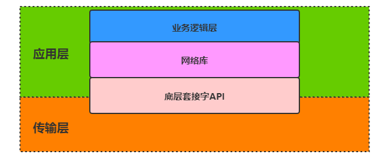

项目背景S：

这个项目主要是在我学习完Linux网络编程相关的技术之后找的，一方面是为了增长网络编程的实际动手能力，另一方面也是为了学习一下C++语言在实际中是如何应用的。

在网络服务器编程中，比如unp描述的回射echo服务器，最传统的实现方式就是使用阻塞迭代的方式来服务一个个到来的客户（socket-bind-listen-accept），但这样最大的缺点在于程序并不支持并发，一旦服务器接受了某一个客户，那么就代表不能再处理新到来客户的连接请求。

因此为了能够支持并发的处理客户的请求，后来又引入了新的解决方案，比如one-client-one-process或者one-client-one-thread这样的解决方案，但实际上这种方式的成本比较高昂，同时系统中进程或者线程也是有限的。所以需要一些新的解决方案，一种比较典型的就是基于进程池或者线程池的方案。

但实际上上述的所有方案都是基于阻塞I/O的方式来进行构建的，如果某一个服务器线程不能从到客户的连接上获取到相应的数据或者说客户根本就没有发送数据给服务器但却又阻塞此，那么此时如果服务器即使想要发送数据给客户端，它也无可奈何，只能等待客户发送过来数据，然后调用write使得服务器有机会向客户端发送数据。显然这样基于阻塞I/O的服务器编程方式是非常愚蠢的，因为服务器根本无法有效且高效的完成作业。

因此为了构建更高效的并发服务器，一种更为有效的方式就是避免使用阻塞I/O，而是使用I/O多路复用+非阻塞I/O这样的解决方案，最为典型的就是使用epoll。这种方案可以使得服务器可以根据与客户连接相关的读写事件可用性来相应的处理客户，使得服务器对客户的处理更具有针对性，即使连接的数量非常大，当然前提这个编程者需要将相应的感兴趣事件注册到epoll对象之中。这种方法实际上就是事件驱动模型。

基于事件驱动的网络编程模型确实高效，但在上面我们所提及的最为简单的实现方式还是有很多的问题需要我们去解决：

- 第一个问题就是业务逻辑和底层的套接字API使用掺杂在一起，对于简单的echo服务器而言业务逻辑简单，我们到可以使用这种方式。但一旦业务逻辑服务复杂了，这样直接使用底层API的方式就变得讨厌。对于业务逻辑层面的编程者而言它不应该去接触这些套接字！所以我们应该需要一种东西去实现“**业务逻辑和底层套接字API或者并发策略分离**”的工作，使得服务器业务逻辑的编程更像是填空一样简单，而上层的编程者完全对底层的东西浑然不知！
- 第二个问题就是既然选择I/O多路复用+非阻塞的方式来构建网络服务器，而实际上这种构建方式（即使去实现不同业务的服务器）在编程实现上是有很多共性存在的，因此我们需要一种通用的网络服务器模式来抽象的描述这种实现方式，使得框架的设计有章可循。这便是基于事件驱动的Reactor模型。我们需要有一种东西**去实现Reactor模型**。
- 第三个问题就是既然选择I/O多路复用+非阻塞I/O的解决方法，就意味着服务器并不能一直总是专门的处理一个客户，这也就意味着客户的消息在此刻不能一下次完全的接收到，所以我们需要**为每一个客户关联一个应用层缓冲区，为每一个客户未一次性接受完全的消息数据进行备份**。业务逻辑的代码应该感知到的是消息包到来的事件而不是其他，至于底层网络I/O的处理到底调用了几次read它根本不知道也不感兴趣。
- 第四个问题就是要使得服务器**能够支持多线程并发**，而不仅仅是单线程。它不仅能够支持单Reactor模型，而且还可以支持多Reactor模型，甚至还能够为其独立于Reactor线程（I/O线程）之外加工作线程池，同时还能够保证线程安全性。
- 其实还有一些其他没有解决的问题，比如解析消息时的oneshot设置。

项目目的T：

上面的需要解决的问题正是这个网络库所设计的目的，它的特点也可以说成是目的：

- 支持快速的构建高并发的Tcp网络服务器，接口简单，只需要用户设置回调即可；
- 业务逻辑和底层套接字API以及并发策略的分离；
- 实现基于事件驱动的Reactor模式，包括单Reactor、多Reactor以及Reactor+线程池的解决方案；
- 提供了可动态扩容的应用层缓冲区

如何解决A行动：

- 通过抽象的方式将具体事件的处理交给具体的事件处理器进行处理，事件循环会在相关事件激活的时候调用注册事件处理器上的回调函数，这样我们就可以解决