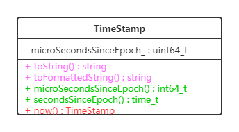
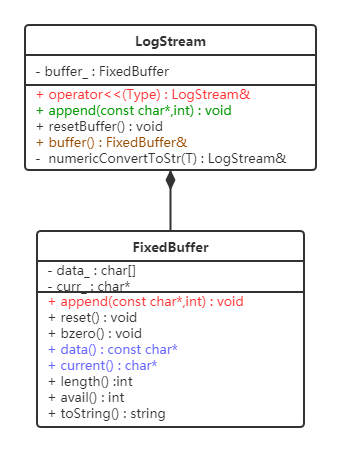
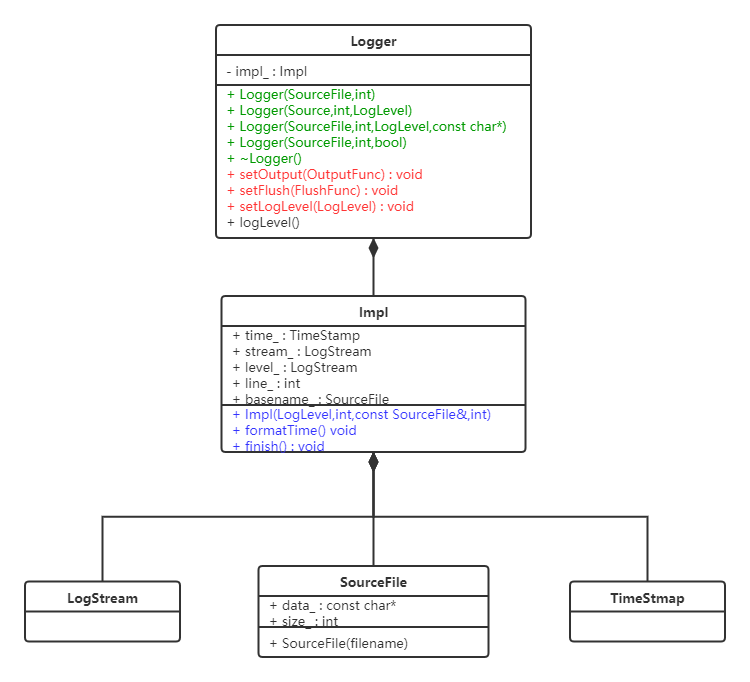
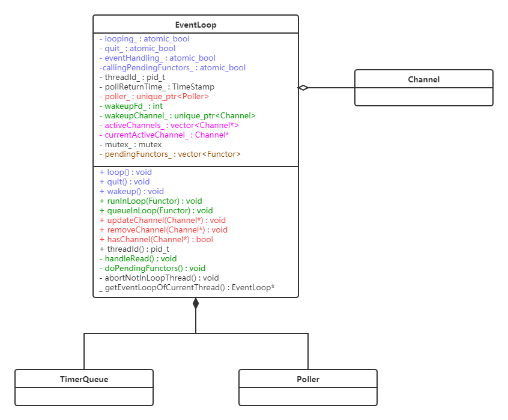

# FakeMuduo

## 一. 基础库base

muduo基础库base中的组件都是一些网络服务器编程中经常使用的组件，包括线程池、有界阻塞队列、日志记录基础设施等。其中如下几个组件是我们了解muduo项目时非常必要的：

- 时间戳类`TimeStamp`
- 线程池类`ThreadPool`
- 日志基础设施类`Logging`、`LogStream`，以及涉及到日志文件滚动输出的类`LogFile`、`FileUtil`

> 需要注意的是还有一些基础设施类虽然在muduo库中比较重要，但是在我自己的FakeMuduo中并没有继续采用，例如线程类Thread、条件变量类Condition的实现等。它们完全可以使用C++11标准库中的


### 1. 时间戳TimeStamp

<center>
    
</center>

时间戳的实现比较简单，最大的功能就是能够提供记录当前时刻的功能。


### 2. 线程池ThreadPool

<center>
    
</center>

线程池的实现也非常简单，最主要的成员函数就是如下几个：

|     成员函数名      |                             功能                             |
| :-----------------: | :----------------------------------------------------------: |
|    **`start()`**    |        创建、启动线程池中的工作线程，并加入到容器之中        |
|    **`stop()`**     | 停止线程池中工作线程的继续运行，但会让工作线程先把<br />手头上的工作执行完毕后再退出 |
|   **`run(Task)`**   | I/O线程将需要回调的可调用对象通过任务队列发送给工作线程处理  |
| **`runInThread()`** | 工作线程所执行的线程函数，它会要求工作线程不断地从<br />任务队列中取出任务进行执行，如果没有就阻塞在条件变量的等待<br />队列之中。或许叫它为线程函数threadFunc也挺合适 |
|    **`take()`**     |           从任务队列中取出一个用以回调的可调用对象           |


### 3. 日志基础设施Logger

#### 3.1 日志流LogStream

<center>
    
</center>

日志流的功能很简单，但在日志基础设施的实现中也非常重要。它的主要功能就是维护一个固定足量大小的缓冲区，后续的日志类通过它的`operator<<()`输出运算符向其添加数据（并自动转换成字符串的形式）到日志流类对象中维护的缓冲区中。然后最后由后续的Logger实现类在它需要析构的时候自动将这些格式化的字符串输出到标准输出或者文件之中。

下面是FixedBuffer的缓冲区示意图：

<center>
    
</center>


#### 3.2 日志器Logger

<center>
    
</center>

在日志基础设施中最为重要的就是日志器Logger，它负责单次日志信息的收集，并在其析构的时候格式化的日志字符串输出到标准输出或者日志文件（需要FileUtil类和LogFile两个类的支持）之中。

其中Logger主要用到了两个内部类：

1. `SourceFile`，它的作用就是用来在给定`__FILE__`字符串宏（当前源文件名）中提取出它的basename，并将其字符串指针保存在SourceFile之中；
2. `Impl`，它可以认为是整个日志器Logger的核心。它主要负责将SourceFile中的basename、当前线程ID、当前时间、日志级别、用户给定字符串、errno返回出的错误字符串等格式化到LogStream日志流对象之中，具体添加的这些信息的手段，很大程度都是依靠LogStream的`operator<<`完成的。

除此之外，在日志器类Logger中，还有一些成员也非常重要，例如用来设置当前日志设施的日志级别`setLogLevel()`、设置当前日志基础设施的日志刷新函数`setFlush()`和设置当前日志基础设施的输出函数`setOutput()`等。

剩下的我们在Logger实现文件的最后定义了一些宏，方便不同级别的日志输出，例如常用的`LOG_TRACE`就是用来最终函数的执行过程，`LOG_INFO`用来进行信息通告等等。


##### 3.2.1 日志输出的执行链

```c++
#define LOG_TRACE if(Logger::logLevel() <= Logger::TRACE) \
    Logger(__FILE__, __LINE__, Logger::TRACE, __func__).stream()
```

最后我们来描述下的一次日志消息（以上面的`LOG_TRACE`为例）的调用链：

1. 首先为了输出一次日志消息，我们会通过上面的宏创建并初始化一个日志器对象Logger；

2. 日志器Logger在创建的过程中会先初始化SourceFile，获取当前的源文件basename：

   ```c++
   Logger(SourceFile file, int line, LogLevel level, const char *func);
             |
             v
   explicit SourceFile(const char *filename);
   ```

3. 接着Logger的构造函数会在开始初始化内部实现类Impl的数据成员，在它的构造之初，会将当前时间的格式化字符串、线程ID、errno错误消息以及当前函数源文件的basename（即上面SourceFile提取出的信息）添加到impl内部的LogStream类对象的FixedBuffer中：

   ```c++
   Logger::Logger(SourceFile file, int line, LogLevel level, const char *func)
   	: impl_(level, 0, file, line) {
     impl_.stream_ << func << ' ';
   }
               |
               v
   Logger::Impl::Impl(LogLevel level, int old_errno, const SourceFile &file, int line)
   	: time_(TimeStamp::now()),
   	  stream_(),
   	  level_(level),
   	  line_(line),
   	  basename_(file) {
     formatTime();
     stream_ << ' ' << gettid() << ' '; // 不使用pthread_self()
     stream_ << LogLevelName[level];
     if (old_errno != 0)
   	stream_ << strerror_ts(old_errno) << " (errno=" << old_errno << ") ";
   }
   ```

4. 然后用户通过`LOG_TRACE`宏创建的Logger对象的`.stream()`成员函数返回内部LogStream类对象的引用，通过`operator<<`运算符向其继续添加自定义的日志消息；

5. 最后输出完毕之后，离开这条语句，这个日志器对象就会自动析构。而析构的时候会自动将内部的日志消息自动输出到标准输出stdout中。

   ```c++
   Logger::~Logger() {
     impl_.finish();
     const LogStream::Buffer &buf(stream().buffer());
     g_output(buf.data(), buf.length());
     if (impl_.level_ == FATAL) {
   	g_flush();
   	abort();
     }
   }
   ```

这样我们基本上就理清了一次日志输出的大致过程，简要一点就是如下的使用过程：

<center>
    
</center>


#### 3.3 日志文件LogFile

如果我们上面输出的日志仅仅需要输出到stdout标准输出中，那么上面的几个类其实完全够用。但是如果需要将这些日志消息输出到滚动更新的日志文件中，那么就需要LogFile和FileUtil这两个类的支持。


## 二. 网络库net

<center>
    
</center>

上面是我为muduo网络库绘制的UML类图，大体的展示了muduo网络库net部分的实现关系。由于muduo网络库的设计采用的是Reactor模式，但在实现上又不完全如Reactor模式论文提出者那样的方式来进行实现。其中论文提出者提出的Reactor模式的类架构体系类似于观察者模式，更多的是采用多态/虚调用的方式来实现事件处理器注册函数的回调；但对于muduo而言，由于它采用的是基于对象的编程方式，所以没有采用上述的方式，在绝大多数的情况，都是通过组合的方式来替代继承。这一点可能参照了“合成复用原则”——多用组合/聚合少用继承。

为了能够实现与论文提出者相同的功能，muduo引入了频道类Channel，用来替代典型Reactor模式中描述的EventHandler。在Reactor论文中指出：每一个具体的事件处理器都需要继承EventHandler，然后通过多态的方式以基类指针注册到事件分发器Dispatcher的事件循环中。而在muduo中，换了种方式，是：每一个事件处理器（包括TcpConnection、Acceptor、TimerQueue等）都需要组合一个Channel，使用时将Channel注册到事件循环EventLoop中。因此，我们可以知道频道类Channel描述了所有事件处理器中事件处理可回调的共性！

<center>
    
</center>

通过上面Reactor原论文中的类图，可以发现，两者有差别，但它们所描述的逻辑原理都是相同的。我们可以以表格形式来对比：

|                 模块                 |                     Reacotr原论文的设计                      |                         muduo的设计                          |
| :----------------------------------: | :----------------------------------------------------------: | :----------------------------------------------------------: |
|            **事件的轮询**            | 通过同步事件多路解复用器Synchronous<br />Event Demultiplexer来完成 |                    通过轮询器Poller来完成                    |
|          **事件循环/分发**           |          通过分派器Initiation Dispatcher来回调分发           |                通过事件循环类EventLoop来完成                 |
| **事件处理器可回调<br />处理的抽象** | 通过事件处理器Event Handler这个接口<br />来提供，每个具体事件处理器都要继承它 | 通过频道Channel类以组合进具体<br />事件处理器的方式来提供共同属性 |
|          **具体事件处理器**          |                    需要继承Event Handler                     |                       需要组合Channel                        |

由上表可知，其实两者大体上差别不大，最主要的差别就两者在“事件处理器可回调处理”这一抽象的表达上的不同，单元里都是相同的。其他都只是名字换了个，理解起来问题不大。


> 经过上面的分析，其实我们也可以了解到对于muduo而言，其网络库中最主要的还是如下几个类：
>
> 1. 事件循环类**EventLoop**
> 2. 事件轮询类**Poller**
> 3. 频道类**Channel**（事件处理器可回调处理的抽象）
> 4. 具体事件处理器，包括：
>    - 网络I/O或连接事件处理器**TcpConnection**
>    - 网络连接请求事件处理器**Accptor**
>    - 系统定时器队列TimeQueue
> 5. TCP服务器类**TcpServer**，它是TcpConnection、Accptor的综合封装
>
> 至少大致了解了这几个类的工作原理，muduo也就基本上没问题了。


### 1. 网络库基础类

在muduo中如下几个类或者文件提供了最基本的网络服务器基本基础设施的功能，包括：

1. SocketetsOps.h/cpp这两个文件封装了大多数我们常用的套接字相关函数
2. Endian.h这个头文件中的内容提供给我们主机字节序与网络字节序之间相互转换的函数，当然也是封装了Linux中比较原始的文件而成的
3. InetAddress类封装了套接字协议地址，方便我们提供给下面的套接字类Socket我们想要的IP+端口号的信息
4. Socket类封装了套接字以及套接字连接、地址绑定、监听、接收等一系列的操作
5. Callback头文件中的声明指出了一个事件处理器应该提供怎样的回调接口。包括：可读事件回调接口、可写事件回调接口、读完成事件回调接口、高水位线回调接口、消息接收回调接口（可读事件触发，有时如果中间加入了一个编解码器，那么只有可能在读取完一个消息之后才会触发）
6. Buffer应用层缓冲区类向TcpConnection提供了数据读缓存和写缓存的能力，这是使用非阻塞I/O时必备的基础设施。实际上它在muduo网络库中是一个很值得谈论的话题，但它对于理解这个Reactor架构而言，重要性相对不大（个人理解）。


### 2. 事件循环EventLoop

<center>
    
</center>

#### 2.1 频道Channel的注册

事件循环类EventLoop最终的功能就是为了事件的监听并在事件触发时进行回调式分发，但能够事件循环的首要前提就是事件循环中有事件！因此EventLoop类提供了如下几个接口：

1. **`updateChannel(Channel*)`**，注册频道，相当于原论文中的`register_handler(h)`，不过如其名在muduo中它还可以用来更新频道关注的事件；
2. **`removeChannel(Channel*)`**，移除频道，相当于原论文中的`remove_handler(h)`，表示不再对这一事件处理器感兴趣。

实际上这些频道的注册/移除操作都是通过内部组合的轮询器Poller来完成的。如下代码所示：

```c++
void EventLoop::updateChannel(Channel *channel) {
  assert(channel->ownerLoop() == this);
  assertInLoopThread();
  poller_->updateChannel(channel);
}
```

不过必须要保证上述两个操作都是在I/O线程（也就是执行这个事件循环的线程）中执行，那么我们如何来保证这些操作一定在I/O线程中执行呢？🤔这一点会在下面进行解释。


#### 2.2 事件的循环和激活分发

在muduo中，事件循环的主要功能实际上并不是EventLoop自己完成，而是通过内部组合的轮询器Poller来完成的，从责任的划分上将它的主要工作是激活事件的分发——逐个调用激活事件相关的Channel上的回调函数（也即事件处理器上的对应处理操作）。所以说这个类的名字称为Dispatcher可能更合适😄！

这个事件的循环和激活分发主要是通过`loop()`成员函数来实现的，其大致逻辑如下：

```c++
void EventLoop::loop() {
  assert(!looping_);
  assertInLoopThread();
  looping_ = true;
  quit_ = false;

  while (!quit_) {
	activeChannels_.clear();
    // 通过Poller中的epoll_wait()等待激活事件的到来
	pollReturnTime_ = poller_->poll(&activeChannels_, kPollTimeMs);

    // 开始回调相关频道上的回调函数
	eventHandling_ = true;
	for (auto &channel:activeChannels_) {
	  currentActiveChannel_ = channel;
	  currentActiveChannel_->handleEvent(pollReturnTime_);
	}
	currentActiveChannel_ = nullptr;
	eventHandling_ = false;
    
    // 特别处理唤醒频道上的可读事件，这个会在下面的<线程安全的
    // 事件循环操作转移调用>来进行讲解
	doPendingFunctors();
  }

  looping_ = false;
}
```

这个逻辑非常简单，即调用Poller中的`poll()`函数，返回时将激活的频道指针放到`activeChannels_`中，然后回调它们的`handleEvent()`成员函数，如此往复。


#### 2.3 线程安全的事件循环操作转移调用

我在上面提到过，如果一个非工作线程试图调用I/O线程中运行的事件循环的某一个成员函数操作，那么怎么能保证这个操作（例如工作线程想更新某一个频道的感兴趣事件：`loop_->updateChannle(chann)`）的线程安全性？因为I/O线程可能正好在用EventLoop中的感兴趣事件集合容器，此时若另一个线程也试图往这个容器中进行修改操作，这显然很容易发生竞态条件😲！！！

解决上述的问题很简单，就是让I/O线程来执行这个操作，而不是工作线程。那问题来了，怎么让这个操作转移到I/O线程中执行？

也很简单，①先将这个操作变成function可调用对象（使用`std::bind()`即可），然后将其加入到事件循环类对象中的某一个function容器中，②接着通过往事件循环特别监听的管道或者eventfd中写入1字节的数据，让I/O线程从`poller_->poll()`操作中返回，表示唤醒事件的激活，③最后I/O线程挨个执行这个function容器中的可调用对象。如此原先在工作线程上的操作就安全的转移到了I/O线程上中执行！

为了实现上述的设计，事件循环引入了如下的几个数据成员和成员函数：

1. **`wakeupFd_`**：唤醒描述符，由`eventfd()`这一Linux独有的系统调用创建，如果为了可移植性可能需要使用管道，但是前者性能更好，当然这里这里不考虑可移植性；

2. **`unique_ptr<Channel> wakeupChannel`**：唤醒通道，事件循环EventLoop从某种程度上讲自己本身也是一个事件处理器，专门就是用来处理被别的线程唤醒这一事件，所以它需要组合一个频道Channel。并在事件循环创建之初，注册到感兴趣事件频道集合中。

   ```c++
   EventLoop::EventLoop()
     .... {
     // 将唤醒频道注册到事件循环中
     wakeupChannel_->setReadCallback(std::bind(&EventLoop::handleRead, this));
     wakeupChannel_->enableReading();
   }
   ```

3. **`handleRead()`**：虽然wakeupFd或者说唤醒通道的作用仅仅是为了唤醒I/O线程从`poll()`中返回，但它事件循环在回调这一频道中的`handleEvent()`的时候，EventLoop还是需要将另一个线程写入到eventfd中的1字节数据读取出来，否则这个事件就会一直被触发（毕竟默认是LT模式嘛）。

4. **`doPendingFunctors()`**：比较有意思的是，被唤醒后别的线程传递给I/O线程的可调用对象任务并不是直接在for循环中直接处理，而是在所有的事件处理器的回调函数调用完毕之后再执行这些function对象，所以有了这个`doPendingFunctors()`成员函数。这样的好处一是可以统一一起处理这些别的线程给它的工作，另一方面是考虑到执行的function对象可能做出了一些比较特别的动作，比如连接的关闭任务等，这一点确实可以好好想想，品品其中的意味。

   最后我们来先看下这个函数的实现（只给出关键部分），也是很有意思：

   ```c++
   void EventLoop::doPendingFunctors() {
     std::vector<Functor> functors;
     {
   	std::lock_guard<std::mutex> lock(mutex_);
       // 通过交换的方式，这样不影响别的线程继续往这个vector中
       // 塞别的function任务
   	functors.swap(pendingFunctors_);
     }
     for (const auto &functor:functors)
   	functor();
   }
   ```

5. **`runInLoop()`**：这是主要留给其他线程的接口，当然I/O线程自己也会用。如果调用这个函数的线程是I/O线程，那么它会直接调用传进来的function对象；否则通过下面的`queueInLoop()`成员以加锁的方式放到事件循环EventLoop对象的pendingFunctors容器中，最后向wakeFd_写1字节数据通知I/O线程。

6. **`queueInLoop()`**：这个函数的作用已经说了，这里不再赘述。


> 总结：通过上面3个小节的分析，我们已经知道EventLoop事件循环类的主要作用就是3个：
>
> - 提供给别的用户感兴趣事件的注册和删除的能力
> - 在注册事件激活的时候及时回调相应频道上的事件处理函数的能力
> - 提供给别的线程将相应任务（生成的function类对象）转移到I/O线程执行的能力，并保证线程安全性
>
> 至于其他的功能对于了解整个muduo框架而言并不是很重要。


### 3. 频道Channel

